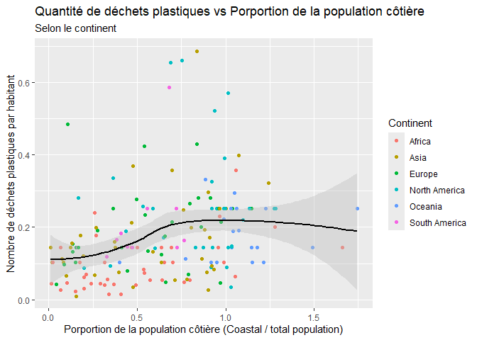

Lab 02 - Plastic waste
================
Kimberly Guertin
15/09/2025

## Chargement des packages et des données

``` r
library(tidyverse) 
```

``` r
plastic_waste <- read_csv("data/plastic-waste.csv")
```

Commençons par filtrer les données pour retirer le point représenté par
Trinité et Tobago (TTO) qui est un outlier.

``` r
plastic_waste <- plastic_waste %>%
  filter(plastic_waste_per_cap < 3.5)
```

## Exercices

### Exercise 1

``` r
ggplot(plastic_waste, aes(x = plastic_waste_per_cap)) +
  geom_histogram(binwidth = 0.2) +
  facet_wrap(~ continent) +
  labs(title = 'quantité de déchet par habitant')
```

<!-- -->

### Exercise 2

``` r
ggplot(plastic_waste, aes(x = plastic_waste_per_cap,
                          fill = continent, color = continent)) + 
  geom_density(adjust = 1,
               alpha = 0.4)
```

<!-- -->

Car le réglage color et fill peut être utiliser dans de nombreux
graphique(général) et est spécifique aux donnés utiliser. Le réglage
alpha est spécifique au graphique de densité, donc affecte seulement les
courbes et non les donnés.

### Exercise 3

Boxplot:

``` r
ggplot(plastic_waste, aes(x = continent, y = plastic_waste_per_cap)) +
  geom_boxplot()
```

<!-- -->

Violin plot:

``` r
ggplot(plastic_waste, aes(x = continent, y = plastic_waste_per_cap)) +
  geom_violin()
```

<!-- -->

Le box plot nous montre la médiane (ou que les points se situe en plus
grosse quantité/résumer des statistique) le violin nous montre tous les
points et leur densité, si un veut analyser un tout le violin est plus
visuel.

### Exercise 4

``` r
ggplot(plastic_waste, aes(x = plastic_waste_per_cap, y = mismanaged_plastic_waste_per_cap, color = continent)) +
  geom_point()
```

<!-- -->

La relation entre les déchets plastique et ceux mal géré est positive
mais il y a une grande dispersion des point, donc ce n’est pas exact
pour tout les continents(pas 100% linéaire) Lorsqu’on ajoute de la
couleur selon les continents on remarques que certains continents
produise peu de déchets mais sont extrêment mal géré. Contrairement a
des continent qui produise énormément de déchets mais sont très bien
géré. Donc l’afrique, l’asie et l’océanie gère moins bien leur déchet et
l’amérique et l’europe les gère bien.

### Exercise 5

``` r
ggplot(plastic_waste, aes(x = plastic_waste_per_cap, y = total_pop, color = continent)) +
  geom_point()
```

    ## Warning: Removed 10 rows containing missing values or values outside the scale range
    ## (`geom_point()`).

<!-- -->

``` r
ggplot(plastic_waste, aes(x = plastic_waste_per_cap, y = coastal_pop, color = continent)) +
  geom_point()
```

<!-- -->

Non les relations sont très semblables

## Conclusion

Recréez la visualisation:

``` r
plastic_waste_coastal <- plastic_waste %>% 
  mutate(coastal_pop_prop = coastal_pop / total_pop) %>%
  filter(plastic_waste_per_cap < 3)
ggplot(plastic_waste_coastal, aes(y = plastic_waste_per_cap, x = coastal_pop_prop, color = continent)) +
  geom_point() +
  geom_smooth(method = 'loess', color = 'black', fill = 'grey', se = TRUE) +
  labs(title = 'Quantité de déchets plastiques vs Porportion de la population côtière', subtitle = 'Selon le continent', x = 'Porportion de la population côtière (Coastal/total population)', y = 'Nombre de déchets plastiques par habitant')
```

    ## `geom_smooth()` using formula = 'y ~ x'

    ## Warning: Removed 10 rows containing non-finite outside the scale range
    ## (`stat_smooth()`).

    ## Warning: Removed 10 rows containing missing values or values outside the scale range
    ## (`geom_point()`).

<!-- -->
